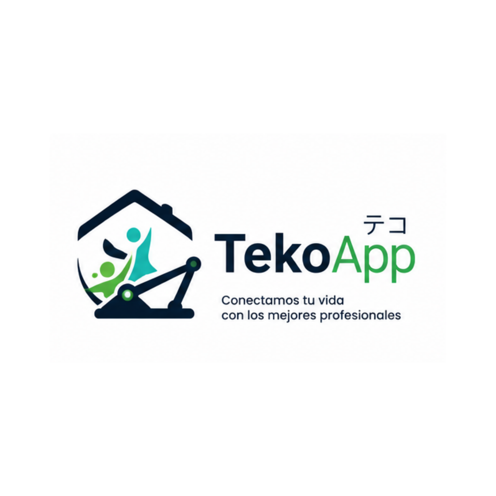

<div align="center">

# TekoApp テコ — Portal Web de Administración



**El panel de control detrás de la conexión entre talento y necesidad.**

[](https://nextjs.org/)
[](https://react.dev/)
[](https://www.typescriptlang.org/)
[](https://tailwindcss.com/)
[](https://ui.shadcn.com/)
[](https://tanstack.com/query)

</div>

---

## Descripción

**TekoApp-Web** es el panel de administración desde el que el equipo de TekoApp gestiona todo el
ecosistema: usuarios y profesionales, solicitudes de servicio en curso, pagos, promociones,
calificaciones, roles/permisos y ubicaciones en tiempo real — la cabina de control de la
plataforma que conecta a las personas con los profesionales que necesitan.

No es un simple CRUD: es el **Backend-for-Frontend** de todo el ecosistema TekoApp. Next.js corre
del lado del servidor como una capa de seguridad propia — cifra credenciales, oculta secretos de
integración y nunca deja que el navegador le hable directo a la API — antes de mostrar un dashboard
rápido, con tema claro/oscuro nativo y pensado para que un desarrollador nuevo encuentre las cosas
sin perderse.

---

## El poder detrás del nombre "Teko"

El nombre de la plataforma fusiona dos conceptos culturales que definen su misión — la misma
historia que el backend, porque toda la marca (acá, en Flutter cuando llegue, y en cualquier
superficie futura) nace de un solo lugar:

| Idioma      | Escritura | Significado       | Simbolismo en este panel                                                                                                                                          |
| ----------- | --------- | ----------------- | ----------------------------------------------------------------------------------------------------------------------------------------------------------------- |
| **Guaraní** | Teko      | _"Vida / Estilo"_ | Cada pantalla de este portal existe para mejorar el día a día de alguien del otro lado — un cliente esperando un servicio, un profesional gestionando su trabajo. |
| **Japonés** | テコ      | _"Palanca"_       | El panel es la palanca operativa: con pocos clics, el equipo de TekoApp multiplica su capacidad de gestionar toda la plataforma.                                  |

---

## Ecosistema de repositorios

| Componente                  | Repositorio                                                           | Stack                                     |
| --------------------------- | --------------------------------------------------------------------- | ----------------------------------------- |
| **Backend Core**            | [TekoApp-Backend](https://github.com/josepanz/TekoApp-Backend)        | NestJS 10, Prisma, Mongoose, Redis, Sharp |
| **Mobile App**              | [TekoApp-Mobile](https://github.com/josepanz/TekoApp-Frontend-Mobile) | Flutter 3, Riverpod, go_router, dio       |
| **Web Admin** _(este repo)_ | TekoApp-Web                                                           | Next.js 16, shadcn/ui, TanStack Query     |

---

## Identidad y diseño


La marca vive en un único lugar — `src/design-system/tokens/tokens.json` (formato W3C Design
Tokens) — y de ahí se genera todo lo demás (`pnpm tokens:build`). Cuando arranque la etapa Flutter,
el mismo archivo alimenta también la app móvil, sin duplicar la definición de marca en ningún lado.

El manual de marca oficial (assets fuente: logo, banner y manual completo) vive en
[`brand/`](brand/) — es la referencia autoritativa para
cualquier duda de color/tipografía que no esté ya resuelta en los tokens.

**Rebrand 2026-08-02**: la paleta se realineó al manual de marca oficial (antes era una paleta
provisoria índigo/coral). Todos los valores están recalculados con contraste WCAG AA real, no solo
a ojo — ver `.claude/rules/accessibility.md` para el detalle de por qué cada shade es el que es.

| Elemento        | Definición                                           | Por qué                                                                                                                           |
| --------------- | ---------------------------------------------------- | --------------------------------------------------------------------------------------------------------------------------------- |
| **Primario**    | Verde TekoApp `#28A745`                              | Color central del manual de marca — usado en el wordmark ("App" del logo) y en los CTA del banner oficial                         |
| **Acento**      | Teal TekoApp `#17BEBB`                               | Segundo color del manual — presente en la iconografía del logo, reservado a un único punto de énfasis por vista (regla 80/20)     |
| **Modo oscuro** | Navy TekoApp `#0D1B2A` exacto, nunca negro puro      | Es el navy real del manual de marca (antes una aproximación índigo) — permite capas/elevación reales en cards y modales           |
| **Tipografía**  | Poppins (única familia, Light/Regular/SemiBold/Bold) | Tipografía oficial del manual — antes Geist (cuerpo) + Sora (títulos), dos familias que el manual no contempla                    |
| **Componentes** | shadcn/ui sobre Base UI                              | El código de cada componente vive en el repo (no en `node_modules`) — cualquiera puede abrirlo y entenderlo, no es una caja negra |
| **Catálogo**    | Storybook                                            | La forma de encontrar qué componentes ya existen sin tener que leer código                                                        |

Ver `.claude/documentation/architecture.md` para el razonamiento completo, y
`.claude/rules/design-system.md` para las reglas de uso.

---

## Arquitectura

Next.js 16 (App Router) actúa como **BFF (Backend-for-Frontend)** frente a `TekoApp-Backend`: el
navegador nunca le habla directo a la API de NestJS. Todo pasa por un proxy autenticado que:

- cifra el password con RSA antes de loguear (nunca texto plano hacia el backend real),
- inyecta las credenciales de cliente (Basic Auth) que la API exige, sin exponerlas jamás al navegador,
- traduce entre las cookies httpOnly que usa el backend y el header `Authorization: Bearer` que sus rutas protegidas realmente esperan.

```
src/
├── app/                    # Routing y HTTP — Route Handlers del BFF (paralelo a api/* del backend)
│   ├── (auth)/login/
│   ├── (dashboard)/        # Overview, users, professionals, services, payments, promotions...
│   └── api/
│       ├── auth/           # login (cifra RSA), refresh, logout
│       ├── realtime/       # ticket de socket.io
│       └── backend/[...path]/  # proxy reverso genérico hacia TekoApp-Backend
├── features/                # Lógica + UI por dominio (paralelo a modules/* del backend)
├── components/{ui,layout}/  # Primitivos shadcn + AppShell/Sidebar/DataTable
├── design-system/tokens/    # Fuente de verdad de marca
├── core/{api-client,auth,config,stores}/
└── lib/                     # Utilidades puras
```

Mapeo completo del razonamiento (por qué Next.js, cómo se resuelve cada fricción de auth del
backend, riesgos conocidos a validar con el equipo de backend) en
`.claude/documentation/architecture.md`.

### Stack

| Capa               | Tecnología                                                                                           | Por qué                                                         |
| ------------------ | ---------------------------------------------------------------------------------------------------- | --------------------------------------------------------------- |
| Framework          | Next.js 16 (App Router), React 19, TS strict                                                         | Server Components + Route Handlers = el BFF de arriba           |
| UI                 | Tailwind CSS 4 + shadcn/ui (Base UI) + lucide-react                                                  | Componentes accesibles, código propio, no una dependencia opaca |
| Servidor de estado | TanStack Query                                                                                       | Cache/reintentos/invalidación sin el boilerplate de Redux       |
| Estado de UI       | Zustand                                                                                              | Sidebar, tema, filtros — sin sobre-ingeniería                   |
| Formularios        | React Hook Form + Zod                                                                                | Mismo espíritu schema-first que `class-validator` en el backend |
| Tipos de API       | `openapi-typescript` desde el Swagger del backend                                                    | Los DTOs nunca se escriben a mano ni se desincronizan           |
| Tests              | Vitest + Testing Library + MSW (unit) · Playwright (e2e)                                             | TDD para todo lo nuevo                                          |
| Mapas              | `@vis.gl/react-google-maps`                                                                          | Mismo proveedor que ya usa el backend                           |
| Realtime           | `socket.io-client`                                                                                   | Contra `LocationsGateway` del backend                           |
| CI/CD              | GitHub Actions (lint→test→build→docker→deploy) + semantic-release                                    | Mismo patrón que `TekoApp-Backend`                              |
| Deploy             | Docker (`output: 'standalone'`), self-hosted K3s/ArgoCD por ahora, portable a Vercel/AWS sin cambios | Sin vendor lock-in                                              |

---

## Instalación y desarrollo local

**Requisitos:** Node.js 22+, pnpm 10+, y `TekoApp-Backend` corriendo (ver su propio README).

```bash
git clone https://github.com/josepanz/TekoApp-Frontend-Web.git
cd TekoApp-Frontend-Web
pnpm install

cp .env.example .env.local
# completar BACKEND_API_URL, BACKEND_CLIENT_ID/SECRET, BACKEND_JWT_PUBLIC_KEY, etc.
# (ver .env.example — cada variable tiene su explicación)

pnpm tokens:build          # genera theme.generated.css desde tokens.json
pnpm dev                    # http://localhost:3001
```

### Comandos útiles

```bash
pnpm lint                  # ESLint + auto-fix
pnpm check:types           # tsc --noEmit
pnpm test                  # Vitest (unit/integración)
pnpm test:e2e              # Playwright
pnpm tokens:build           # regenerar CSS de marca desde tokens.json
pnpm generate:api-types     # regenerar tipos desde el Swagger del backend
pnpm build && pnpm start    # producción local
```

### Docker

```bash
docker build -t tekoapp-frontend-web:latest .
docker run -p 3001:3001 --env-file .env tekoapp-frontend-web:latest
```

---

## Contribuir

1. Fork del repositorio.
2. Rama: `git checkout -b feature/nueva-feature`.
3. `pnpm lint && pnpm check:types && pnpm test` en verde antes de abrir el PR.
4. Commits siguiendo Conventional Commits: `git commit -m 'feat: descripción'`.
5. Pull Request describiendo el cambio y su motivación.

> Todo el código fuertemente tipado — no se aceptan PRs con `any` ni sin test para lógica nueva.
> Ver `.claude/CLAUDE.md` para las reglas completas del proyecto.

---

## Contacto

**José Panza** — CEO/CTO, Tech Lead, Architect & Senior Staff Engineer

- 𝕏 (Twitter): [@PanzerPy](https://twitter.com/PanzerPy)
- Email: josepanza1@gmail.com

✨ _"Conectando talento con necesidad, donde sea, cuando sea."_
